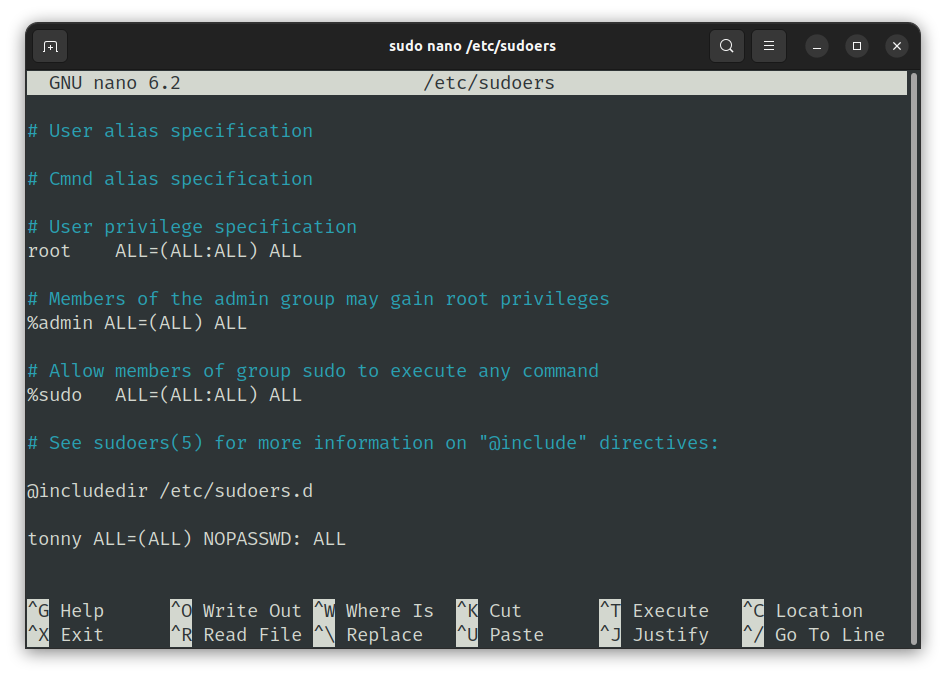
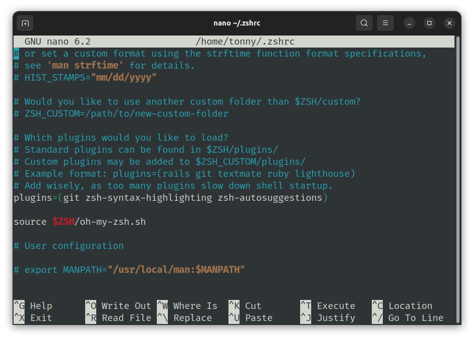

<h1 align="center">
  <a href="[Tonny-Weslley](https://github.com/Tonny-Weslley)">
    
  </a>
</h1>


# Configuração de Terminal Linux 

> by [tonny weslley](https://github.com/Tonny-Weslley).

### Recomendações
Para proceguir com a configuração do terminal, certifique está com o git instalado na sua maquina, caso não esteja, instale pelo comando:

    sudo apt install git

Para evitar ter que sempre digitar a sua senha quando usar o comando sudo, aconselho que busque o arquivo sudoers e adicione a seguinte linha ao fim do arquivo:

    myuser ALL=(ALL) NOPASSWD: ALL
alterando o myuser pelo seu nome de usuário

   


## 1 - Instalando o ZSH
site oficial do zsh: https://ohmyz.sh/
repositório oficial : https://github.com/ohmyzsh/ohmyzsh

Para instalar o zsh, basta executar o seguinte comando no terminal:

    sudo apt install zsh
   
   Após isso, é possivel acessar o zsh via:
   

    zsh
E selecione a opção de popular o arquivo .zshrc (Caso exista, ela só aparece na primeira vez que abrimos o zsh).

É possível definir o zsh como terminal padrão através do comando:
   

    chsh -s /usr/bin/zsh

   
   ## 2 - Instalando NerdFonts
Para que o tema funcione corretamente, é necessária a instalação de uma fonte da família NerdFonts, minha recomendação é a Fira code, mas você pode ver todas as fontes compatíveis nesse [link](https://www.nerdfonts.com/).

você pode baixar a Fira code através do seu repositório oficial: https://github.com/tonsky/FiraCode 

Após baixar, basta extrair o conteúdo e instalar as fontes presentes na pasta *ttf*.

O próximo passo é definir a Fira code como fonte padrão da aplicação do terminal.


## 3 - Instalando Tema Spaceship
Existe uma infinidade de temas para o zsh, mas particularmente, meu preferido é o [spaceship](https://spaceship-prompt.sh/), para instalar o tema, basta executar as seguintes linhas de comando em seu terminal:

```
 git clone https://github.com/spaceship-prompt/spaceship-prompt.git "$ZSH_CUSTOM/themes/spaceship-prompt" --depth=1 
 ```

```
ln -s "$ZSH_CUSTOM/themes/spaceship-prompt/spaceship.zsh-theme" "$ZSH_CUSTOM/themes/spaceship.zsh-theme"
```
Agora o proximo passo é definir o tema spaceship como tema do zsh.
edite o arquivo .zshrc.
```
nano ~/.zshrc
```

procure o campo ZSH_THEME e altere seu valor para spaceship.


## 3 - Instalando Extensões
Assim como temas, o zsh tem uma infinidade de extensões, varias delas estão documentadas no repositório [zhs-users](https://github.com/zsh-users), por hora instalaremos apenas as duas mais comuns, [zsh-autosuggestions](https://github.com/zsh-users/zsh-autosuggestions) e [zsh-syntax-highlighting](https://github.com/zsh-users/zsh-syntax-highlighting).
Para instalar as extensões execute os comandos:

```
git clone https://github.com/zsh-users/zsh-autosuggestions ${ZSH_CUSTOM:-~/.oh-my-zsh/custom}/plugins/zsh-autosuggestions
```
```
git clone https://github.com/zsh-users/zsh-syntax-highlighting.git ${ZSH_CUSTOM:-~/.oh-my-zsh/custom}/plugins/zsh-syntax-highlighting
```

Após isso, basta voltar no arquivo .zshrc, procurar por plugins e adicionar a seguinte linha dentro dos parênteses:

    zsh-autosuggestions zsh-syntax-highlighting

